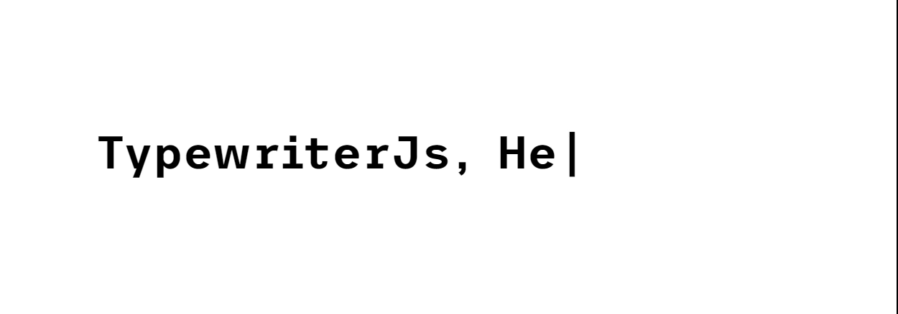

# TypewriterJs
Este es un mini proyecto con la unica finalidad de crear el efecto de maquina de escribir sin depender de ninguna libreria, se estara acualizando con el tiempo.



Enlaza el archivo **TypewriterJs.js**

``` html
    <script src="TypewriterJs.js"></script>
```

Para utilizar este efecto hay que añadir una clase llamada **sheet-write** a un elemento
con estas condiciones:

- Elemento padre padre que contenga dentro solo el siguiente elemento o solo texto
    - Elemento con la clase **sheet-write**
    - El elemento con la clase **sheet-write** debe tener un atributo llamado **data-words**
        - El atributo **data-words** debe contener como valor un array con los mensajes a mostrar (con comillas simples)

**Ejemplo**
``` html
    <div>
        <span class="title-description" data-words='["Hola!","Fezil dia."]'>Data atributos</span>
    </div>
```
Con el ejemplo ya bastaria para utilizar este efecto pero hay mas opciones que puedes utilizar.

## Opciones

> los valones numericos representan el tiempo en milisegundos

Data-atributos | Valor (Valores por defecto) | Descripcion
---------------|-------|------------
initdelay   | 10        | tiempo de espera antes de escribir el mensaje ( apartir del segundo elemento )
writespeed  | 100       | velocidad de escritura
deletespeed | 40        | velocidad de eliminacion
delaydelete | 5000      | tiempo de espera antes de borrar el mensaje actual
infinite    | true      | para evitar el efecto infinito solo haria falta colocar este atributo y pasarle como valor **false**


